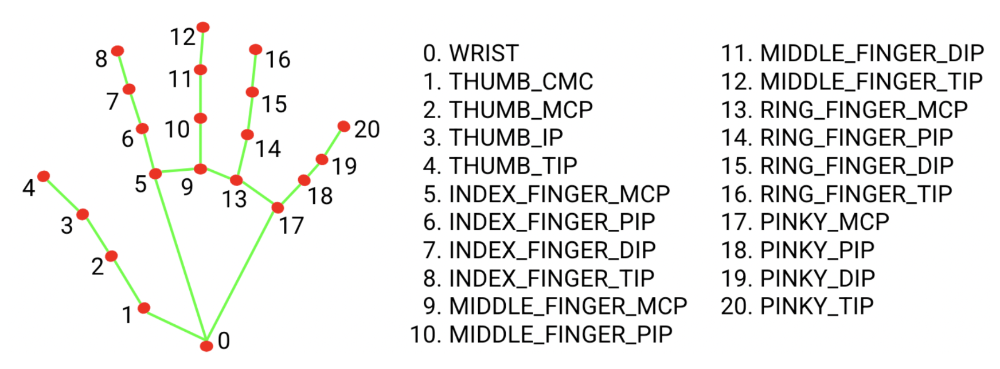

# VMotionDrive: Vision Enhanced Wearable Control for Cars

This repo is created for the M202 Final Project in Fall 2023

## Table of Contents

1. [Team](#team)
2. [Abstract](#abstract)
3. [Objective](#objective)
4. [Setup](#setup)

## Team

* Guanyu Qian
* Allen (Yilun) Huang

## Abstract

In the expansive domain of autonomous driving, where vehicles often operate in isolation from human intervention, our innovation strives to reintroduce human interaction – but from a perspective not previously explored. Instead of being limited within the cabin, we imagine a world where drivers can step out and control their vehicles from the outside. This proposal is advantageous for narrow parking situations or navigating congested areas.\
While adept at capturing gestures, vision-only systems often have difficulty achieving the precision needed for car controls, especially in environments with variable lighting or obstructions. On the other hand, while promising accuracy, wearable-only solutions suffer from their continuous signal transmission, which can blur the boundaries of intentional commands. We aim to capitalize on the gesture recognition of the former and the precision of the latter by fusing vision with wearables.

## Objective

Our approach is to interpret hand movements as sequenced motions. A gesture is not seen as an isolated movement but as part of a continuum. The initial hand gesture acts as an activation sign, a starting point for sending instruction signals. The wearable device then steps in and refines these commands, offering precise and nuanced control over the vehicle.\
We aim to use computer vision for gesture recognition utilizing Python and an accelerometer for the wearable device to send XYZ signals.

## Setup

### Hardware 

* Raspberry Pi 4
* Laptop for vision processing
* Motors
* Router
* Camera

### Software

* Python

## Gesture Extraction

## Project Timeline

### Prototype (Nov 1, 2023)

