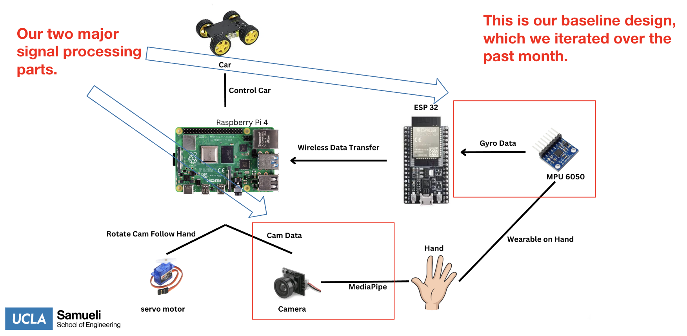
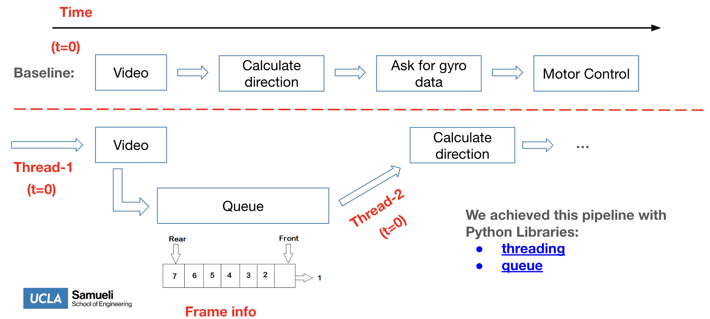

# Table of Contents
* Abstract
* [Introduction](#1-introduction)
* [Related Work](#2-related-work)
* [Technical Approach](#3-technical-approach)
* [Evaluation and Results](#4-evaluation-and-results)
* [Discussion and Conclusions](#5-discussion-and-conclusions)
* [References](#6-references)

# Abstract

In the expansive domain of autonomous driving, where vehicles often operate in isolation from human intervention, our innovation strives to reintroduce human interaction – but from a perspective not previously explored. Instead of being limited within the cabin, we imagine a world where drivers can step out and control their vehicles from the outside. This proposal is advantageous for narrow parking situations or navigating congested areas. While adept at capturing gestures, vision-only systems often have difficulty achieving the precision needed for car controls, especially in environments with variable lighting or obstructions. On the other hand, while promising accuracy, wearable-only solutions suffer from their continuous signal transmission, which can blur the boundaries of intentional commands. We aim to capitalize on the gesture recognition of the former and the precision of the latter by fusing vision with wearables.

# 1. Introduction

## Motivation & Objective
 This project aimed to transform how we interact with vehicles. We aimed to enable drivers to control their cars from outside, using gestures and wearables. This approach was born from the desire to make urban driving more manageable and intuitive, especially in tight spaces like narrow parking and congested areas.

## State of the Art & Its Limitations
 Currently, autonomous driving technologies rely heavily on in-car controls and automated systems. While recent advancements in vision-based gesture control are impressive, they offer only discrete control options, limiting their practicality in complex driving scenarios. Our project sought to overcome this by integrating vision-based systems with wearable technology, allowing for more nuanced, continuous control — akin to using a hand as a mouse to navigate more precisely.

## Novelty & Rationale 
The innovative aspect of our project lies in this seamless integration of gesture recognition with wearable tech. This combination enables continuous, fluid control commands, a significant leap from the binary commands typical in current systems. This approach will succeed because it aligns with natural human movements, making it more intuitive and effective for users.

## Potential Impact 
 We can extend this method to many other applications. Specifically, We envision a world where I can turn it into a virtual mouse or an interactive tool for various devices with a flick of the hand. This technology can seamlessly integrate into everyday life, transforming our interactions with our surroundings. I could use gestures in smart homes to control lighting and temperature, creating a more responsive and intuitive living environment. It could revolutionize how presentations are conducted in office settings, making interactions more engaging and fluid.

## Challenges 
One of the primary challenges lies in creating a gesture recognition system that boasts high accuracy and reliability across diverse environments. Moreover, minimizing the latency in gesture recognition is a significant consideration for precise control, especially considering the computational power limitations of the Raspberry Pi platform. Additionally, ensuring a fluid transition between the wearable control and vision recognition modes is crucial to maintaining system efficacy and user engagement. Lastly, it is essential to design these wearables in a way that they are intuitive, user-friendly, and comfortable for prolonged use, thereby encouraging widespread adoption and a positive user experience.

## Requirements for Success
 To successfully complete our project,  we need access to technologies like MediaPipe for advanced media processing, along with algorithms designed to accelerate processing speeds. Proficiency in 3D printing is crucial for creating wearables, as is expertise in signal processing for accurate data interpretation. The project also demands high-performance computing solutions to address the limitations of platforms like Raspberry Pi.
 
## Metrics of Success 
Success metrics for this project focus on several key performance indicators. High accuracy in gesture recognition is essential to ensure the system reliably interprets user commands. Low latency is also critical, as it directly impacts the system's responsiveness and efficiency. Seamless integration of vision and wearables is vital to demonstrating the system's adaptability and compatibility. A practical functionality test will be the system's ability to control a vehicle through a predetermined test course, demonstrating its effectiveness in real-world scenarios. 

# 2. Related Work

The work (DOI: 10.1007/978-3-031-05544-7_19) presents a fascinating intersection of gesture recognition and robot control by exploring the innovative approach of controlling a ROS car using the Mediapipe framework. However, there are some limitations to this approach that arise from running the computer vision algorithms on a personal computer.

One of the main drawbacks of running CV on a PC is that the reliance on a PC for processing limits the mobility and scalability of the system. For a truly mobile and flexible application, it would be advantageous to integrate the CV capabilities directly into the ROS car or to use more portable computing solutions. The current setup requires the ROS car to be within the effective range of the PC's processing and communication capabilities, which limits the operational range of the vehicle.

It is worth noting that many YouTube projects use discrete control using similar technologies and requiring a stationary camera setup relative to the person making the gestures. While these projects are innovative, they sometimes face challenges in gesture intuitiveness and interpretability, pointing to underlying Explainable AI (XAI) issues. In addition, these projects rely on a PC to run the computer vision algorithms, as opposed to the more integrated approach for the embedded systems. This reliance can introduce additional complexity and potential latency in the processing of the gestures. Nevertheless, these projects collectively contribute to the evolving landscape of gesture-based control in robotics, each offering unique insights and methodologies that push the boundaries of human-computer interaction.

# 3. Technical Approach

## Overview

As shown in the figure , our system includes two main signal processing streams, the first being the camera data for CV. The second is the gryo data form wearables, including the MPU6050 and ESP32. 

## Wearable

Sensor integration: The MPU6050, a micro-electron-mechanical system (MEMS), provides dual functionality as a three-axis gyroscope and a three-axis accelerometer. This sensor is capable of detecting both angular velocity and linear acceleration, providing a comprehensive data set of hand movements in 3D space.

Data transfer to ESP32: Raw data from the MPU6050 is transferred to the ESP32 microcontroller via an I2C bus. This protocol was chosen for its high data transfer rates and robust error-checking capabilities, which are essential for accurate gesture capture.

Data pre-processing: The ESP32 acts as a data transmitter, receiving and sending data between the Raspberry Pi and the mpu6050.

Wireless data relay to Raspberry Pi: The ESP32 uses a Wi-Fi module to transmit the processed gyro data to the Raspberry Pi. The WebSocket protocol over Wi-Fi ensures a bi-directional, full-duplex communication channel, enabling efficient real-time data streaming. The Raspberry Pi also performs preliminary pre-processing, including digital low-pass filtering, to mitigate the effects of high-frequency noise and vibration on the sensor data. This step is critical to improving data quality.

### Wearable Design and Optimization

To improve the quality of the data received from the MPU6050 sensor, we apply a moving average filter to the equation given below. This filter is crucial to mitigate the effects of transient noise and improve the overall clarity of the signal. As shown in the following table, the implementation of this filter improves the quality of the signal by smoothing out erratic fluctuations and noise. 

In our system, the process of transforming raw sensor data into a format suitable for vehicle control is both complex and essential. This raw data consists of linear acceleration and angular velocity measurements from the MPU6050 sensor. The conversion process is based on a specific formula. It starts by converting the accelerometer data into angular measurements. These angular measurements are crucial because they directly relate to the vehicle's angle of rotation. By accurately determining these angles, we can precisely control the vehicle's linear speed and effectively determine its direction. The control logic uses the roll and pitch angles to define the four primary directional movements: Forward, reverse, left, and right.

The Euler angles - roll, pitch, and yaw - were chosen specifically for their intuitiveness and natural alignment with the physical movements of the vehicle. They provide a more interpretable and user-friendly format for vehicle control, greatly enhancing the ease of interaction with the system. In our system design, the relationship between Euler angles and vehicle motion is direct and clearly defined:

These Euler angles provide a precise and comprehensive description of the user's intended gestures, enabling the system to accurately interpret and execute the speed of the vehicle's movements.

## Camera-based Gesture Detection System

We use a wide-angle camera and advanced gesture recognition, MediaPipe, with a low frame rate connected to the Raspberry Pi for real-time gesture detection. The choice of camera is critical: its wide field of view captures a wide visual area, ensuring that no gesture goes undetected. 

### Optimized CV Pipeline

We have significantly optimized the Computer Vision (CV) pipeline, using advanced Python programming techniques to enhance its real-time hand gesture recognition capabilities. Central to these improvements is the use of multi-threading, which allows image capture and gesture interpretation tasks to be processed simultaneously. This parallel processing methodology has dramatically reduced system latency - a critical metric in real-time applications - from an initial 3 seconds to just 0.5 seconds, an 83% reduction in response time.

Key to the efficiency of our pipeline is the implementation of a queuing system. This system ensures that video frames are processed sequentially as they are captured, preserving the chronological integrity of the data stream. This is essential for maintaining the accuracy of gesture recognition over time.

A key enhancement to our CV pipeline is the transition from YUYV to MJPEG (Motion JPEG) video format. This strategic change addresses the bandwidth and processing power limitations of the YUYV format. By adopting MJPEG, which compresses each video frame independently, we have achieved a significant reduction in data size. This reduction allows video frames to be processed more quickly without sacrificing image quality, which is critical for accurate gesture recognition and interpretation.

Further refinements to our pipeline include setting optimal parameters for the MJPEG format. By setting the frame rate to 20fps and the resolution to 640x360, we've been able to strike a balance between image clarity and system performance. This specific configuration not only improves the accuracy of gesture recognition but also results in a significant reduction in CPU usage - around 15%. This reduction in processing demand translates directly into improved energy efficiency, as shown in the figure.

## Motor Control

PWM signal generation for motor control: The integrated control signals are converted to PWM outputs. These signals precisely control the vehicle's motor controllers, regulating speed and steering mechanisms based on the user's gestures.

# 4. Evaluation and Results

## Testing
Our evaluation strategy is meticulously designed to thoroughly assess the performance and reliability of our autonomous vehicle control system, encompassing both controlled and real-world testing environments.

### Stationary Testing:
* This test aims to isolate and evaluate the system's response to input controls in a static environment.
* The vehicle is positioned with its wheels off the ground, simulating movement without physical displacement.
* Testing Protocol: We execute a series of predefined gestures and gyroscopic inputs, observing the system's response in controlling the vehicle's wheels. This method allows us to precisely measure the response time and accuracy of the control system in a controlled environment, free from external variables.

### Routine Testing:

* Unlike stationary testing, routine testing places the vehicle in a real-world setting, where it navigates a predetermined course.
* Using gestures and gyroscopic inputs, we control the vehicle through various maneuvers, replicating typical usage scenarios. The test is recorded, and a link to the video is provided for visual reference and analysis.
* This test evaluates the system’s adaptability to real-world conditions, including its response to environmental variables and its navigation and obstacle avoidance capabilities.

## In-Depth Performance Metrics

To quantitatively assess the system, we focus on three critical metrics: latency, consistency, and robustness, each offering insights into different aspects of system performance.

### Latency:
* We employ a sophisticated time-stamping method in the command window during operation to accurately measure the system's response time to various gestures.
* We conduct multiple trials for each gesture, aggregating the data to plot a comprehensive latency profile. This statistical approach allows us to determine the average latency and its standard deviation, providing insight into the system’s response time and its variability.
* The average latency of around 0.22 seconds, combined with low variability, indicates a highly responsive system.

### Consistency:
* Consistency is evaluated through a detailed analysis of the linear relationship between gyroscopic data (input) and motor speed (output). This is done by incrementally increasing the gyro angle and measuring the corresponding wheel speed.
* A dynamic graph or animated visualization is used to demonstrate this relationship, offering a clear and intuitive understanding of how input variations translate to motor control.

### Robustness:
* Robustness is tested by deliberately creating scenarios where camera-detected gestures and gyroscopic data are misaligned. For example, if the camera detects a forward gesture but the gyro does not register the corresponding orientation, the vehicle should not move.
* Error handling is crucial for evaluating the system's error-handling capabilities and ensuring operational safety, especially in scenarios where incorrect gesture interpretation could lead to unintended movements.

# 5. Discussion and Conclusions

In conclusion, our project has demonstrated significant potential in the field of car control through wearable technology and computer vision systems. The proposed future improvements aim to address the current limitations and expand the capabilities of the system. By improving our system's accuracy, ergonomics, and computational power, we can pave the way for more intuitive, efficient, and user-friendly controls in vehicles. These improvements are crucial for the development of our project but also contribute to the broader field of human-computer interaction and vehicular technology.

Future improvements in wearable technology focus on enhancing user comfort and sensor accuracy through ergonomic designs like ring-shaped wearables and implementing Kalman filters and advanced 9-axis gyro sensors. In computer vision systems, advancements include upgrading to more powerful processors like the Jetson Nano, integrating dual cameras for better depth perception and field of view, and optimizing machine learning models for embedded systems to streamline gesture recognition processes.

# 6. References

Allena, C. D., De Leon, R. C., & Wong, Y. Y. (2022). Easy hand gesture control of a ROS-Car using Google MediaPipe for surveillance use. In *Lecture Notes in Computer Science* (pp. 247–260). [https://doi.org/10.1007/978-3-031-05544-7_19](https://doi.org/10.1007/978-3-031-05544-7_19)

L. Fiorini et al., "Daily Gesture Recognition During Human-Robot Interaction Combining Vision and Wearable Systems," in IEEE Sensors Journal, vol. 21, no. 20, pp. 23568-23577, 15 Oct.15, 2021, doi: 10.1109/JSEN.2021.3108011.

